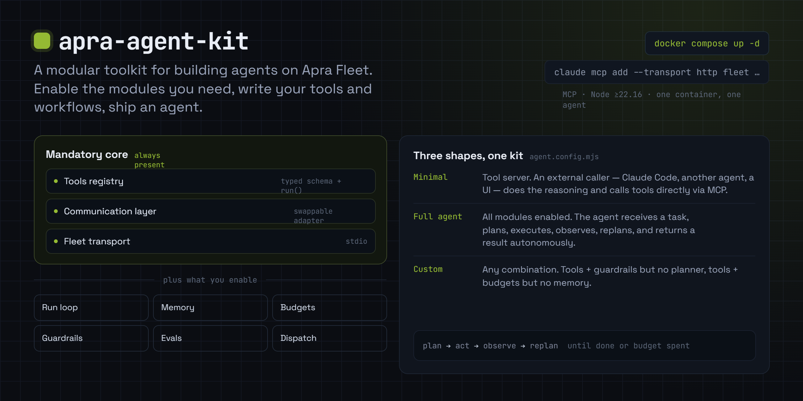
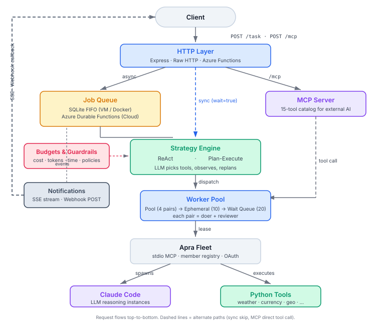
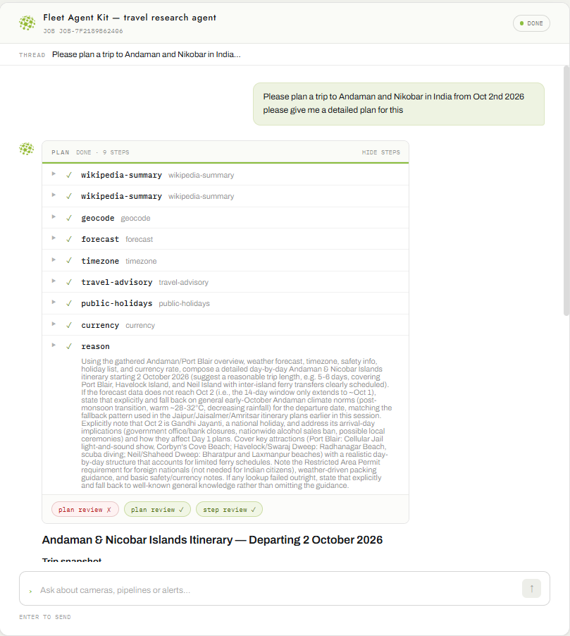
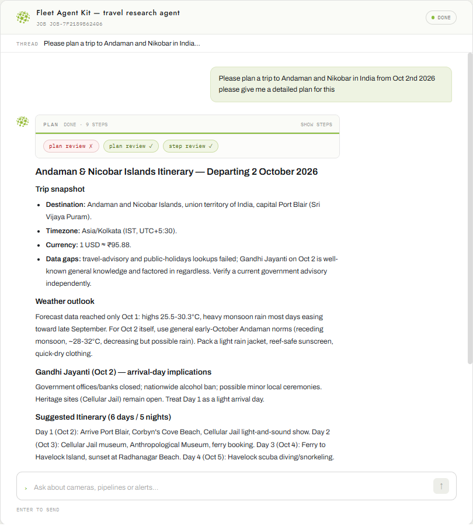
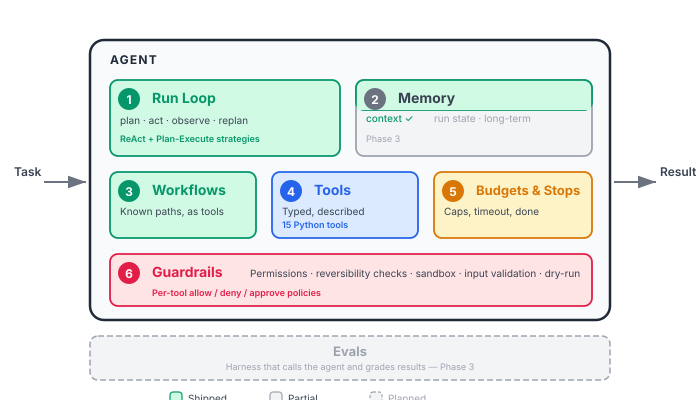

<p align="center">
  
</p>

<h3 align="center">A modular toolkit for building autonomous AI agents on <a href="https://github.com/Apra-Labs/apra-fleet">Apra Fleet</a></h3>

<p align="center">
  <a href="docs/getting-started.md"><strong>Getting Started</strong></a> · 
  <a href="docs/architecture.md"><strong>Architecture</strong></a> · 
  <a href="docs/roadmap.md"><strong>Roadmap</strong></a>
</p>

---

## What is the Agent Kit?

An agent takes in a task and gets it over the finish line. Everything else — chat, MCP,
schedules, queues — is a door into that one function.

This kit gives you that function, pre-wired with everything a production agent needs:

<p align="center">
  
</p>

**Three operating modes:**

- **Full Agent** — receives a task at `POST /task`, plans, executes tools, observes results,
  replans on failure, returns autonomously
- **Tool Server** — external AI (Claude Code, Cursor, another agent) drives reasoning,
  calls tools via MCP at `POST /mcp`
- **Custom** — enable only the modules you need

One container runs one agent. Scaling is horizontal: more containers, each with its own agent.

<table align="center"><tr>
<td></td>
<td></td>
</tr><tr>
<td align="center"><em>9-step travel plan</em></td>
<td align="center"><em>Final itinerary</em></td>
</tr></table>

---

## What an agent is made of

A task goes in, a result comes out. Six parts inside the boundary make that happen.

<p align="center">
  
</p>

| # | Part | What it does | Status |
|---|------|-------------|--------|
| 1 | **Run Loop** | The core. Decides the next step and calls tools until done. Two strategies: **ReAct** (decide each turn) and **Plan-Execute** (plan upfront, replan on failure). | Shipped |
| 2 | **Memory** | Three kinds: working context (what's in the LLM window), run state (crash recovery), long-term (cross-run facts). | Working context shipped. Run state + long-term in Phase 3. |
| 3 | **Workflows** | Known sequences written as plain code and exposed as tools. If you already know the steps, don't make the agent figure them out. | Shipped |
| 4 | **Tools** | Typed schemas, model-facing descriptions. Errors are returned, not thrown. 15 Python tools ship out of the box. | Shipped |
| 5 | **Budgets & Stops** | Iteration cap (25), cost ceiling ($5), token limit (500K), wall-clock timeout (10 min), explicit definition of done. | Shipped |
| 6 | **Guardrails** | Per-tool allow/deny policies, reversibility classification, filesystem sandboxing, input validation, dry-run mode. | Shipped |
| — | **Evals** | Sits outside the boundary — a harness that calls the whole box and grades what comes out. 20-50 real tasks with graded outcomes. | Phase 3 |

---

## Getting Started — Build Your Own Agent

### Prerequisites

- Node.js 22.16+
- Python 3
- Apra Fleet: `npm install -g @apralabs/apra-fleet && apra-fleet install`

### 1. Clone and install

```bash
git clone https://github.com/dsiddharth2/apra-agent-kit.git
cd apra-agent-kit
npm install
```

### 2. Configure your agent

Edit `host.config.mjs` — this is the single file that defines your agent:

```js
export default {
  name: 'my-agent',
  description: 'What your agent does — the LLM reads this',
  agentDescription: 'You are a helpful assistant that...',

  modules: {
    runLoop: {
      strategy: 'plan-execute',     // or 'open-ended'
    },
    budgets: {
      maxIterations: 25,
      maxCostUsd: 5.00,
      maxTokens: 500_000,
      timeoutMs: 600_000,           // 10 minutes
    },
    guardrails: {
      defaultPolicy: 'allow',
      policies: {
        // 'dangerous-tool': 'deny',
        // 'sensitive-tool': 'approve',
      },
    },
    dispatch: { enabled: true },
    notify: { sse: { enabled: true } },
    chat: { enabled: true, title: 'My Agent' },
  },
};
```

### 3. Add a tool

Write a Python script in `tools/your-tool/your_tool.py`:

```python
import sys, json

def main():
    args = json.loads(sys.argv[1])
    # ... your logic here ...
    print(json.dumps({"result": "your output"}))

if __name__ == "__main__":
    main()
```

Register it in `mcp/registry.mjs`:

```js
{
  name: 'your-tool',
  description: 'What this tool does — the LLM reads this to decide when to use it',
  inputSchema: {
    type: 'object',
    properties: {
      param1: { type: 'string', description: 'What this parameter is' },
    },
    required: ['param1'],
  },
  run: async ({ fleetApi, args }) => {
    const result = await fleetApi.executeCommand(
      'doer',
      `python3 tools/your-tool/your_tool.py '${JSON.stringify(args)}'`
    );
    return extractText(result);
  },
}
```

### 4. Run it

```bash
export CLAUDE_CODE_OAUTH_TOKEN="$(claude setup-token)"
node host/index.mjs
```

Open [http://localhost:3000/chat](http://localhost:3000/chat) — your agent is live.

Or with Docker:
```bash
CLAUDE_CODE_OAUTH_TOKEN="your-token" docker compose up -d
```

### 5. Use it

```bash
# Chat UI
open http://localhost:3000/chat

# Submit a task via API
curl -sX POST localhost:3000/task \
  -H "content-type: application/json" \
  -d '{"goal":"What is the weather in Tokyo?"}'

# Stream progress in real time
curl -N localhost:3000/jobs/<jobId>/events

# Connect another AI via MCP
claude mcp add --transport http my-agent http://127.0.0.1:3000/mcp
```

For the full Getting Started guide including deployment:
**[docs/getting-started.md](docs/getting-started.md)**

---

## How the System Works

A task enters through one of four doors (the communication layer), hits the agent's run
loop, and comes out as a result. See the full
**[Architecture Guide](docs/architecture.md)** for details.

**The run loop** picks a strategy:
- **Plan-Execute** — doer writes a plan, reviewer approves it, steps execute one by one.
  If a step fails, it replans. Best for multi-step tasks.
- **ReAct (Open-Ended)** — decides what to do next each turn based on what just happened.
  Handles surprises. Costs more.

**The worker pool** manages Claude Code instances in three tiers: 4 pre-provisioned pairs,
up to 10 ephemeral overflow pairs, then a wait queue.

**The job queue** handles async tasks with real-time progress via SSE and webhook callbacks.
Two backends: SQLite (local/Docker) or Azure Durable Functions (cloud).

| Document | Covers |
|---|---|
| **[docs/architecture.md](docs/architecture.md)** | Component diagram, layers, data flow, design decisions |
| [docs/run-loop.md](docs/run-loop.md) | Strategies, budgets, guardrails, `/task` API |
| [docs/jobs.md](docs/jobs.md) | Async jobs: submit, poll, SSE, webhooks, cancellation |
| [docs/concurrency.md](docs/concurrency.md) | Worker pool, job queue, dispatch config |
| [docs/mcp-interface.md](docs/mcp-interface.md) | MCP tool catalog, registry contract |
| [docs/chat-ui.md](docs/chat-ui.md) | Chat page: theming, events, status pipeline |
| [docs/deploy-azure-functions.md](docs/deploy-azure-functions.md) | Azure Functions deployment |

---

## Roadmap

See the full **[Roadmap](docs/roadmap.md)** for what's shipped, in progress, and planned.

**Next up — Phase 3: Memory + Eval**
- Three kinds of memory: working context, run state, long-term
- Eval harness: 20-50 real tasks with graded outcomes, runs on every prompt/model change
- Strategy auto-router: classifies tasks and picks the best strategy automatically

---

## Contributing

We welcome contributions. Here's how:

### Fork and PR workflow

1. **Fork** the repo on GitHub
2. **Clone** your fork: `git clone https://github.com/<you>/apra-agent-kit.git`
3. **Create a branch**: `git checkout -b feature/your-feature`
4. **Make your changes** — follow the conventions in [docs/development.md](docs/development.md)
5. **Run tests**: `npm test` (mock tests — no Fleet binary or tokens needed)
6. **Push** to your fork: `git push origin feature/your-feature`
7. **Open a PR** against `main`

### What to contribute

- **New tools** — write a Python script, register it in the catalog
- **Bug fixes** — especially around edge cases in the run loop or job queue
- **Documentation** — improvements, examples, tutorials
- **Tests** — more mock tests for strategies, guardrails, budgets
- **New strategies** — implement a different planning/execution approach

### Development setup

```bash
git clone https://github.com/dsiddharth2/apra-agent-kit.git
cd apra-agent-kit
npm install
npm test    # verify everything works — no Fleet needed
```

See [docs/development.md](docs/development.md) for the full setup, testing guide, and conventions.

---

## FAQ

**Q: Do I need Apra Fleet installed to run tests?**
No. `npm test` uses mock Fleet clients — no binary, no members, no OAuth token required.
You only need Fleet installed to run the agent live.

**Q: What's the difference between `/mcp` and `/task`?**
`/mcp` is for external AI that brings its own brain — it picks tools from the catalog and
calls them. `/task` is for callers that want this agent's brain — it plans and executes
autonomously. Both share the same tools, worker pool, and guardrails.

**Q: Can I use OpenAI or other providers instead of Claude?**
Fleet supports registering members with different LLM providers. The kit's architecture
doesn't lock you into Claude — though today the worker pool provisions Claude Code instances.
Multi-provider support is on the roadmap.

**Q: How much does a task cost?**
Depends on the task complexity and strategy. Budget defaults cap at $5 per task, 500K tokens,
and 25 LLM iterations. You can override these per-request or in config. A typical 5-tool
travel briefing costs around $0.50-1.00.

**Q: What happens if the agent crashes mid-task?**
On restart, the in-process job backend fails any `processing` jobs (marks them failed) and
re-queues any `queued` jobs. Run-state memory for crash resumption is coming in Phase 3.

**Q: Can I run multiple agents?**
Yes. One container runs one agent. Scale horizontally with more containers, each configured
for a different domain (travel agent, data agent, etc.) or as replicas of the same agent.

**Q: Why Python for tools instead of JavaScript?**
Tools run via `fleetApi.executeCommand()` on a Fleet member's machine — they're shell commands,
not imported modules. Python was chosen because most data/API scripts are simpler in Python
with stdlib (`urllib`, `json`, `sys`). You can write tools in any language that reads args
from `sys.argv` and prints JSON to stdout.

**Q: How do I deploy to production?**
Two paths: Docker Compose on a VM (uses Express + SQLite backend), or Azure Functions Premium
(uses Durable Functions backend for managed scaling). See
[docs/deploy-azure-functions.md](docs/deploy-azure-functions.md).

**Q: What's the difference between workflows and agent reasoning?**
If you already know the steps, write a workflow (plain code, exposed as a tool). It's faster,
cheaper, and predictable. Use the agent for tasks where the path is unknown — it decides each
step from what happened. Bad pattern: an agent walking a fixed sequence you already knew.

---

## License

MIT
