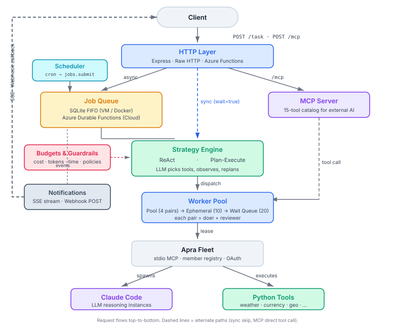

# Architecture

How this repo is put together. Read this before changing code.
If you just want to run something, start with the [Getting Started guide](getting-started.md).

> **Visual version:** open [architecture-diagram.html](architecture-diagram.html) in a browser
> for the interactive component diagram with color-coded layers.

## What this is

An autonomous AI agent server built on [Apra Fleet](https://github.com/Apra-Labs/apra-fleet).
You give it a task in plain English, it figures out what tools to use, runs them, and gives
you back the answer.

Three operating modes:

- **Minimal (Tool Server)** — external AI (Claude Code, another agent) drives reasoning,
  calls tools via MCP at `/mcp`
- **Full Agent** — receives a task at `/task`, plans, executes, observes, replans, returns
  autonomously
- **Custom** — any combination of modules

## Component diagram

<p align="center">
  
</p>

## Components

**HTTP Layer** (`comm/`) —
The front door. Accepts task requests, serves the MCP tool endpoint, and hosts the chat UI.
Swappable between Express (local/Docker), raw HTTP, or Azure Functions.

**Job Queue** (`host/jobs/`) —
Handles async tasks. When you fire-and-forget a task, it gets queued and a worker picks it up.
SQLite-backed locally, Azure Durable Functions in the cloud.
Jobs go through: `queued → processing → completed / failed / cancelled / budget_exceeded`.

**Scheduler** (`host/scheduler/`) —
Fires named workflows on cron schedules. Config-driven (schedules live in
`host.config.mjs`). Each tick submits a job through the jobs pipeline — the
scheduler is a clock, nothing more. Two backends: in-process (croner timers
in Node) for VM/Docker, Azure Timer Triggers for Functions.
See [scheduled-workflows.md](scheduled-workflows.md) for configuration and usage.

**MCP Server** (`mcp/`) —
Exposes 15 tools as an MCP catalog so an external AI (like Claude Code) can call them directly,
without the agent doing its own planning.

**Strategy Engine** (`host/strategies/`) —
The brain. Two modes:

- **ReAct** — simple loop: ask the LLM what to do next, do it, repeat until done. Uses one
  worker (doer).
- **Plan-Execute** — doer creates a plan, reviewer approves it, steps execute one by one,
  replan on failure. Uses two workers (doer + reviewer).

**Budgets & Guardrails** (`host/budgets.mjs`, `host/guardrails.mjs`) —
Safety rails around the strategy loop. Default caps: 25 iterations, $5 cost, 500K tokens,
10 min timeout. Per-tool allow/deny policies and filesystem sandboxing.

**Worker Pool** (`pool/`) —
Manages Claude Code instances in three tiers:

1. **Pool** — 4 pre-provisioned doer/reviewer pairs, grabbed instantly
2. **Ephemeral** — up to 10 on-demand overflow pairs, self-destruct after use
3. **Wait Queue** — up to 20 pending requests, 5 min timeout

Each pair = a doer (does the work) + a reviewer (checks the plan).

**Memory** (`host/memory/`) —
Three independent tiers that give the agent context beyond the current task:

- **Conversation context** — prior chat turns within a browser session. Before each task,
  turns are loaded from SQLite, decayed via FSRS-6, and optionally compacted (older turns
  summarised by the LLM or dropped). The formatted history is injected into the system prompt
  so the agent can understand references like "the cheapest one" or "do that again". After the
  task, the goal+answer pair is recorded as a new turn.

- **Run state** — crash recovery. The plan-execute strategy checkpoints after each completed
  step. If the process crashes, the next restart loads the checkpoint and resumes from the
  last step instead of starting over.

- **Long-term memory** — cross-session facts with spaced-repetition decay. Facts are stored
  with a `kind` (domain, preference, pattern, procedure) and `tags`. Before each task, relevant
  facts are recalled by tag and injected into the system prompt. After the task, the **learner**
  sends the observation history to the LLM to extract reusable facts (auto-learn). Facts that
  go unused decay via FSRS-6 (`active → dormant → silent → unavailable`); facts that are used
  are reinforced and survive longer. The agent also gets four tools (`remember`, `recall`,
  `forget`, `promote`) to manage memory explicitly during a task.

All three tiers use pluggable store adapters (SQLite for local, Cosmos for Azure). Memory
failures never halt a task — every operation is wrapped in try/catch with graceful fallbacks.

**Notifications** (`host/notify/`) —
Pushes job progress out in real time. SSE stream for browser clients, webhook POST with
retry for server-to-server callbacks.

**Apra Fleet** (child process) —
The foundation. Runs as a child process over stdio (MCP JSON-RPC). Manages member workspaces,
OAuth credentials, and spawns Claude Code CLI instances for each worker.

**Python Tools** (`tools/`) —
15 tools (weather, currency, geocode, Wikipedia, etc.) — all plain Python using only stdlib,
executed on Fleet member machines via `executeCommand`.

## Data flow

### Sync task (`POST /task?wait=true`)

```
Client → HTTP → executeHostedTask → dispatch (acquire worker pair)
  → router classifies goal (workflow / plan-execute / open-ended)
  → recall long-term memory (by task tags)
  → load conversation context (by sessionId)
  → strategy loop (LLM sees memories + conversation in system prompt,
     picks tools, observes, replans)
  → learner extracts new facts into long-term memory
  → record conversation turn
  → return result in same HTTP response
  → release worker pair
```

### Async task (`POST /task`)

```
Client → HTTP → jobs.submit → SQLite queue → return 202 + jobId
  ↓ worker loop picks up
  executeHostedTask → recall + conversation load → strategy loop
    → progress events (including memory recall/learn) → settled
    → learner + conversation record
  ↓ fan-out
  SSE subscribers ← notifier → webhook POST

Client watches: GET /jobs/:id/events (SSE stream)
Client cancels:  DELETE /jobs/:id
```

### MCP tool call (`POST /mcp`)

```
External AI → picks tool from catalog → dispatch (acquire pair)
  → guardrails check → tool.run() → result → release pair
```

## HTTP endpoints

See [jobs.md](jobs.md) for the full API reference with request/response details.

## Tool catalog

15 tools registered in `mcp/registry.mjs`, all Python scripts using only stdlib:

| Tool | What it does |
|------|-------------|
| `weather` | Current weather from wttr.in |
| `forecast` | Multi-day forecast from Open-Meteo |
| `timezone` | Local time from timeapi.io |
| `currency` | Exchange rates from ECB via frankfurter.app |
| `geocode` | City → lat/lon via Nominatim (OSM) |
| `country-info` | Country details from Wikipedia + Nominatim |
| `travel-advisory` | Safety advisories by country |
| `wikipedia-summary` | Wikipedia summary for any topic |
| `places-of-interest` | Tourist attractions from Wikipedia search |
| `route-distance` | Driving distance/time via OSRM |
| `public-holidays` | Public holidays from Nager.Date |
| `textstats` | Text character/word/sentence analysis |
| `demo` | End-to-end Fleet smoke test (workflow) |
| `city-briefing` | Weather + timezone + agent-composed briefing (workflow) |
| `inspect-members` | Reports on worker pair registration (workflow) |

## Directory structure

```
├── comm/                  HTTP adapters (Express, raw-http, Azure Functions)
├── host/                  Autonomous agent host
│   ├── strategies/        ReAct and Plan-Execute async generators
│   ├── prompts/           LLM prompt templates
│   ├── memory/            Three-tier memory system
│   │   ├── conversation-store/  Conversation turn adapters (SQLite, Cosmos)
│   │   ├── store/         Long-term memory adapters (SQLite, Cosmos, filesystem)
│   │   ├── decay/         FSRS-6 spaced-repetition engine + timer
│   │   └── dedup/         Duplicate fact detection
│   ├── jobs/              Job queue backends + SQLite store
│   ├── notify/            SSE and webhook notification channels
│   ├── tools/             Tool registry + executor + memory tools
│   └── chat/              Built-in chat UI
├── mcp/                   MCP tool server (registry, server builder, HTTP)
├── pool/                  Worker dispatch (pool, ephemeral, queue tiers)
├── transport/             Fleet stdio spawn + MCP client
├── tools/                 Python tool scripts
├── workflows/             Demo, city-briefing, inspect-members
└── host.config.mjs        Central configuration
```

## Configuration

All settings live in `host.config.mjs`. See [getting-started.md](getting-started.md) for
the full annotated config reference with environment variables.

## Design decisions

**Two front doors, not one.** `/mcp` is for external AI that brings its own brain. `/task`
is for callers that want this server's brain. They share the same tool registry, worker pool,
and guardrails — the difference is who decides what to call.

**Fleet runs as a stdio child, not HTTP.** `spawnFleet()` launches `apra-fleet run --transport stdio`
and connects an MCP client. Every Fleet operation is one MCP tool call over stdin/stdout.

**Workers are registered at startup.** A fresh Fleet process starts empty. `MemberManager`
registers the pool roster (and ephemeral pairs on demand). Each member gets its own work
folder — two members sharing a folder will collide.

**`fleetApi` is injectable.** Both launchers accept a client and only spawn Fleet when one
isn't given. This makes mock tests possible with no Fleet binary, no members, and no token.

**Budgets are per-request.** Each `/task` creates a fresh budget, merging server defaults with
request overrides (stricter wins). Iteration count tracks LLM calls, not tool calls.

**Cancellation is cooperative.** In-process backends abort via `AbortSignal`. On Azure Durable
Functions, the activity polls `customStatus.cancelRequested` because DELETE may hit a different
instance.

**Backend pairing is enforced.** `in-process` (SQLite) pairs with `express` or `raw-http`.
`durable` requires `azure-functions`. Cross-pairing throws at startup.

**Memory never blocks the task.** Every memory operation (recall, store, conversation load,
learner extraction) is wrapped in try/catch. If the store is down, recall returns empty,
the learner skips extraction, and the task runs with a blank slate. The agent is useful
without memory — memory makes it better over time but is never load-bearing.

**FSRS-6 for decay, not heuristics.** The kit uses the FSRS-6 spaced-repetition algorithm
(pre-trained on 700M+ Anki reviews) rather than simple time-based expiry. Facts that are
used grow more stable (decay slower); facts that go unused fade on a mathematically
principled curve. This means frequently useful knowledge survives indefinitely while
one-off trivia disappears naturally.

**Conversation context replaces working context.** The original working-context tier
compacted intra-task observations, but both strategies already maintain a local
`observations[]` array that serves the same purpose. Conversation context carries turns
*across* tasks — a fundamentally different scope that provides real user-visible value.
